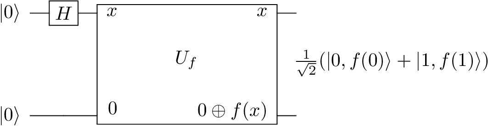
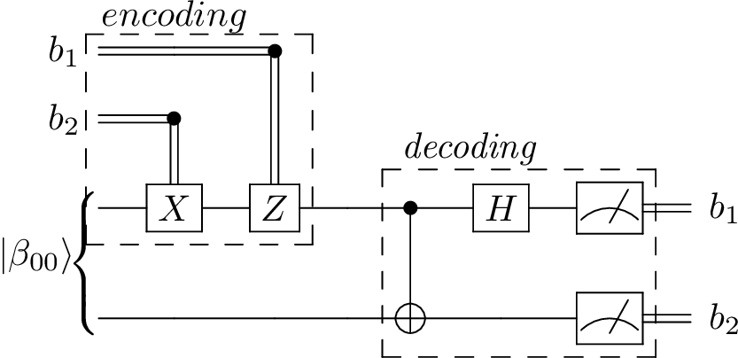

.. _examples_page:

Examples
========

This page demonstrates how QCircuits can be used to simulate example
quantum algorithms.

Producing Bell States
=====================

Example code producing each of the four entangled Bell states for a two-qubit system.

The circuit diagram is

.. image:: images/bell.png
    :width: 70%

where \|x⟩ and \|y⟩ are each one of the computational basis states, \|0⟩ or \|1⟩.

E.g., :math:`|\beta_{00}⟩ = \frac{1}{\sqrt{2}} (|00⟩ + |11⟩)`.

**Code**:

.. literalinclude:: ../../examples/produce_bell_states.py

Quantum Teleportation
=====================

.. image:: images/teleport.png
    :width: 100%

**Code**:

.. literalinclude:: ../../examples/quantum_teleportation.py

Quantum Parallelism
===================

**Code**:

.. literalinclude:: ../../examples/quantum_parallelism.py

Deutsch's Algorithm
===================

.. image:: images/deutsch.png
    :width: 100%

**Code**:

.. literalinclude:: ../../examples/deutsch_algorithm.py

The Deutsch-Jorza Algorithm
===========================

.. image:: images/deutsch_jorza.png
    :width: 100%

**Code**:

.. literalinclude:: ../../examples/deutsch_jorza_algorithm.py

Superdense Coding
=================

**Code**:

.. literalinclude:: ../../examples/superdense_coding.py
